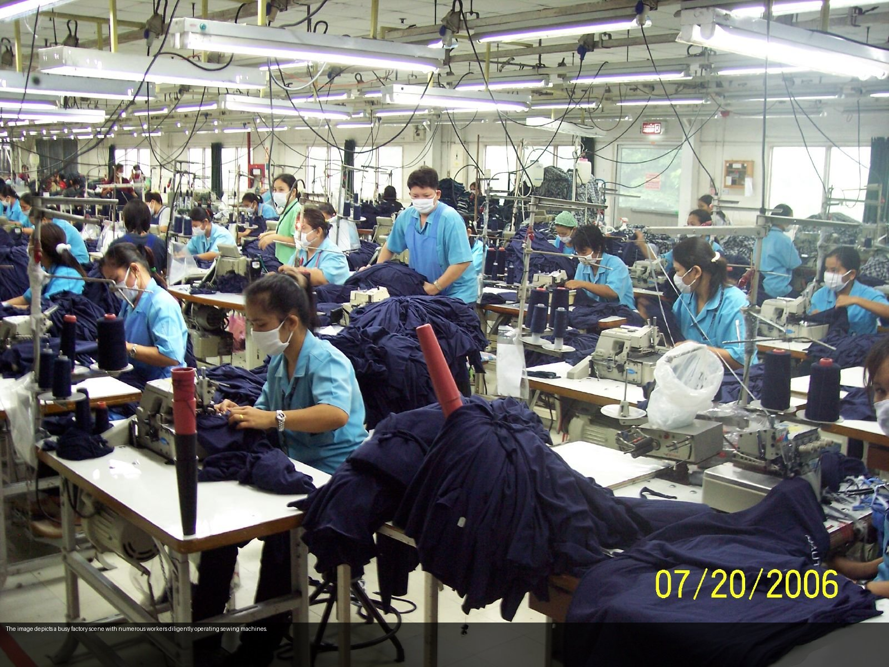
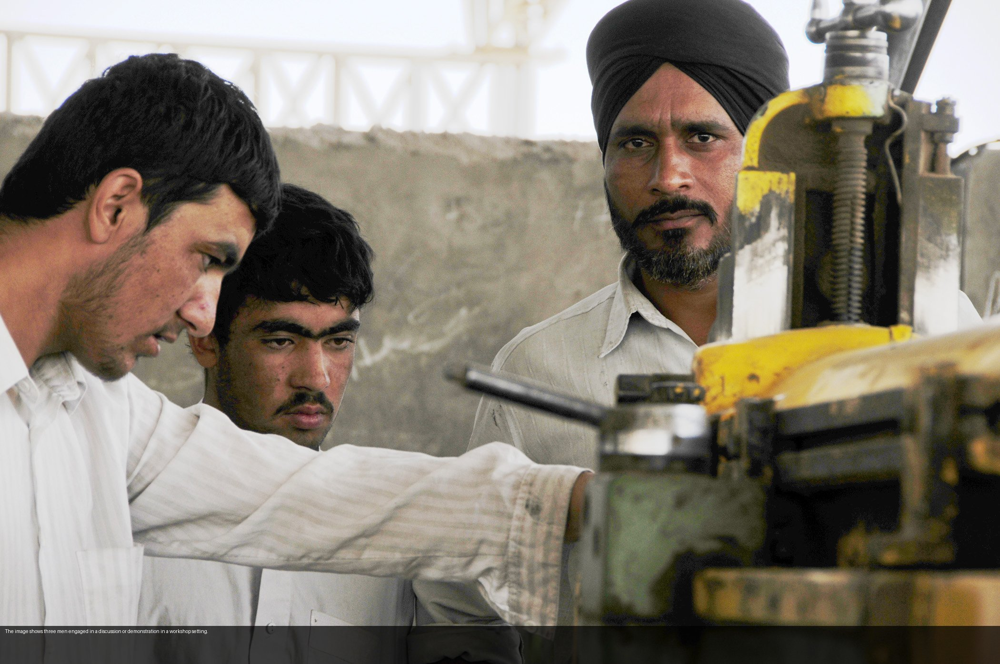
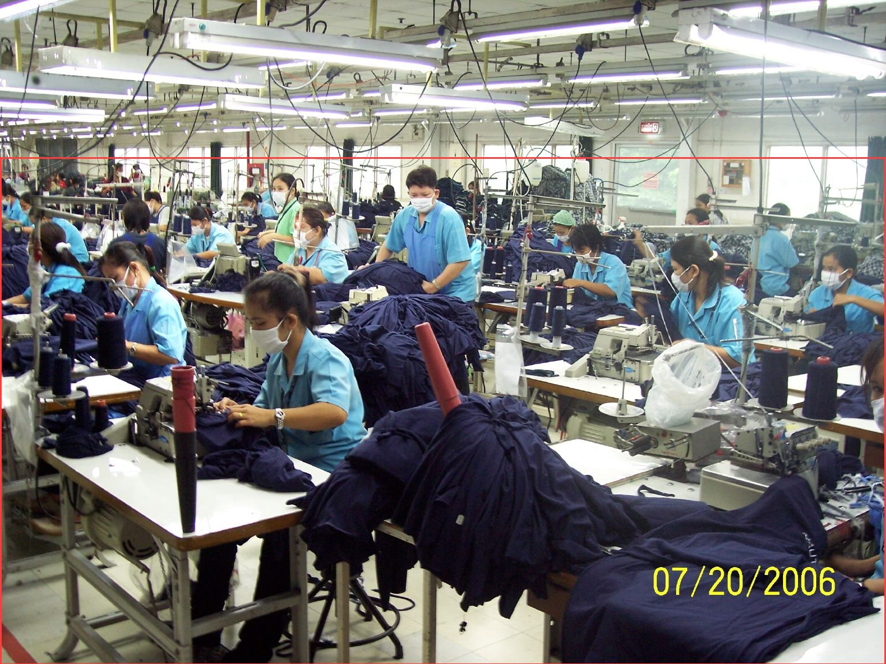
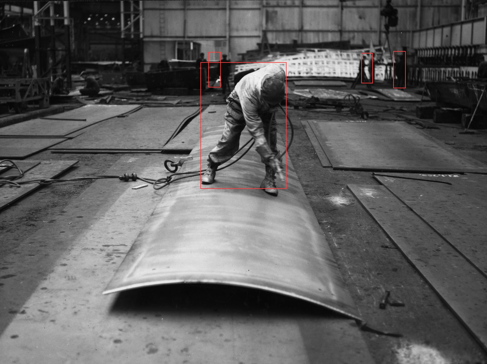

# moondream2-factory-vision

在 Apple Silicon / NVIDIA GPU 上執行 [Moondream 2](https://github.com/vikhyatk/moondream) 視覺語言模型的工廠影像分析工具集。支援圖像描述、視覺問答、物件偵測、目標定位，提供互動 CLI 與批量處理兩種模式。

---

## 目錄

- [Moondream 是什麼](#moondream-是什麼)
- [運作原理](#運作原理)
- [四個核心功能](#四個核心功能)
- [Demo](#demo)
- [安裝](#安裝)
- [使用方式](#使用方式)
  - [互動 CLI（moondream.py）](#互動-climoondreampy)
  - [H100 雲端 CLI（moondream3_h100.py）](#h100-雲端-climoondream3_h100py)
  - [批量處理（batch.py）](#批量處理batchpy)
- [系統整合指南](#系統整合指南)
- [硬體需求](#硬體需求)
- [檔案說明](#檔案說明)

---

## Moondream 是什麼

Moondream 是一個**視覺語言模型（VLM, Vision-Language Model）**，能同時理解圖像和文字。你給它一張圖和一個問題，它直接用自然語言回答——不需要預先標記資料、不需要訓練，直接用英文指令描述你想偵測的目標就能執行。

| 版本 | 參數量 | 適合場景 |
|------|--------|----------|
| Moondream 2 | 2B | Mac / 邊緣設備 / 一般 GPU |
| Moondream 3 Preview | 9B MoE | H100 / A100（VRAM ≥ 20GB）|

---

## 運作原理

Moondream 2 的架構分兩個部分：

```
圖像輸入
   │
   ▼
┌──────────────────┐
│  Vision Encoder  │  ← SigLIP（Google 的圖像理解模型）
│  （圖像 → 向量）  │    把圖片壓縮成一組「視覺 token」
└────────┬─────────┘
         │ 視覺 token
         ▼
┌──────────────────┐
│  Language Model  │  ← Phi-1.5（Microsoft 2B 文字生成模型）
│  （理解 + 生成）  │    結合文字指令，輸出自然語言結果
└──────────────────┘
         │
         ▼
   文字輸出 / BBox 座標
```

**Vision Encoder（SigLIP）**
把圖片拆成固定大小的 patch，每個 patch 轉成向量，形成對圖像語意的理解。這個步驟叫 `encode_image()`，結果可以快取並重複使用於同一張圖的多次查詢。

**Language Model（Phi-1.5）**
接收視覺 token + 你的文字 prompt，用 autoregressive 方式逐 token 生成輸出。`detect` 和 `point` 功能的輸出是 JSON 格式的正規化座標（0.0 ~ 1.0），需要乘以圖像寬高才能得到像素座標。

**關鍵特性：Zero-Shot**
不需要針對廠區影像額外訓練或標記資料，模型本身已有足夠的世界知識，直接用英文描述目標（`"person"`、`"helmet"`）即可偵測。

---

## 四個核心功能

| 功能 | 說明 | 輸出格式 |
|------|------|----------|
| `caption` | 自動描述圖片內容 | 自然語言字串 |
| `query` | 對圖片自由提問 | 自然語言字串 |
| `detect` | 偵測指定物件，輸出範圍框 | `[{x_min, y_min, x_max, y_max}]`（0~1 正規化）|
| `point` | 定位指定部位，輸出點座標 | `[{x, y}]`（0~1 正規化）|

**detect vs point 差別：**
- `detect "person"` → 框出每個人的**矩形範圍**（適合存在性判斷、計數）
- `point "person's face"` → 標出臉部的**精確座標點**（適合姿態、注意力分析）

> **注意：** prompt 請用英文，中文效果不穩定。

---

## Demo

以下 demo 使用公開授權圖片，由 Moondream 2 在 Apple M4（MPS）本機生成。

### Caption — 自動圖像描述

| 原圖 | Caption 結果 |
|------|------|
|  | "A busy factory scene with numerous workers operating sewing machines." |
|  | "Three men engaged in a discussion in a workshop setting." |

### Detect — 人員偵測

紅框 = `detect "person"` 輸出，BBox 座標正規化為 0~1，可直接對應任意解析度。

| 偵測結果 |
|----------|
|  |
|  |

---

## 安裝

```bash
git clone https://github.com/livejiaquan/moondream2-factory-vision.git
cd moondream2-factory-vision

python3 -m venv .venv
source .venv/bin/activate
pip install transformers==4.46.3 torch Pillow einops
```

首次執行會自動下載模型快取（約 3.7 GB）：
- Mac：存於 `~/.cache/huggingface/hub/models--vikhyatk--moondream2/`
- 之後啟動約 10–15 秒，無需重複下載

---

## 使用方式

### 互動 CLI（moondream.py）

適合單張圖片測試，模型只載入一次，可連續執行多個指令。

```bash
python moondream.py chat -i 你的圖片.jpg
```

互動模式內的指令：

```
>>> caption              # 圖像描述（一般長度）
>>> caption long         # 詳細描述
>>> query What safety equipment is the worker wearing?
>>> detect person
>>> detect helmet
>>> point person's face
>>> load 另一張圖.jpg    # 換圖片（不需重啟）
>>> quit
```

單次執行：

```bash
python moondream.py caption -i image.jpg
python moondream.py caption -i image.jpg --length long
python moondream.py query   -i image.jpg -q "Is the worker wearing a helmet?"
python moondream.py detect  -i image.jpg -t "person" -o result.jpg
python moondream.py point   -i image.jpg -t "person's face" -o result.jpg
```

---

### H100 雲端 CLI（moondream3_h100.py）

適合無 GUI 的雲端環境（SSH 連線），detect / point 結果自動儲存至 `output/`。

設定 HF Token（Moondream 3 為 Gated Model 需要）：

```python
# moondream3_h100.py 第 44 行
HF_TOKEN = "hf_你的token"
```

執行：

```bash
python moondream3_h100.py 你的圖片.jpg
```

輸出命名規則（序號遞增，不覆蓋）：

```
output/
  001_detect_person.jpg
  002_point_persons_face.jpg
  003_detect_helmet.jpg
```

---

### 批量處理（batch.py）

對整個資料夾做批量辨識，適合 CCTV 影像批次分析。

```bash
# 批量 caption
python batch.py caption -d images/ --model 3 -o output/

# 批量偵測人員
python batch.py detect -d images/ -t "person" --model 3 -o output/

# 批量偵測安全帽
python batch.py detect -d images/ -t "helmet" --model 3 -o output/

# 批量問答
python batch.py query -d images/ -q "Is there a person not wearing a helmet?" --model 3 -o output/
```

輸出：
- `caption` → `output/captions_md3.csv`（每張圖的描述）
- `detect` → 有找到目標的圖才存標註圖（`原檔名_detect.jpg`）
- `query` → `output/query_results.csv`

參數說明：

| 參數 | 說明 | 預設 |
|------|------|------|
| `-d` | 圖片資料夾路徑 | 必填 |
| `-o` | 輸出資料夾 | `output_batch/` |
| `-t` | 偵測目標（detect/point 用） | — |
| `-q` | 問題（query 用） | — |
| `--model` | `2` / `3` / `both` | `3` |
| `--length` | `short` / `normal` / `long`（caption 用）| `normal` |

---

## 系統整合指南

給想把 Moondream 整合進既有系統的開發者。

### Python API 基本用法

```python
from transformers import AutoModelForCausalLM
from PIL import Image
import torch

# 載入模型（一次，之後重複使用）
model = AutoModelForCausalLM.from_pretrained(
    "vikhyatk/moondream2",
    revision="2025-01-09",
    trust_remote_code=True,
    dtype=torch.float16,        # float16 省記憶體
).to("mps").eval()              # Mac 用 mps，NVIDIA 用 cuda

# 圖像編碼（耗時，建議快取）
img = Image.open("frame.jpg").convert("RGB")
enc = model.encode_image(img)

# 四個功能
caption = model.caption(enc, length="normal")["caption"]
answer  = model.query(enc,   "Is the worker wearing a helmet?")["answer"]
boxes   = model.detect(enc,  "person")["objects"]   # [{x_min,y_min,x_max,y_max}]
points  = model.point(enc,   "person's face")["points"]  # [{x,y}]
```

### BBox 座標還原

`detect` 輸出的座標是正規化值（0.0 ~ 1.0），換算成像素：

```python
W, H = img.size
for obj in boxes:
    x1 = int(obj["x_min"] * W)
    y1 = int(obj["y_min"] * H)
    x2 = int(obj["x_max"] * W)
    y2 = int(obj["y_max"] * H)
    # 在此畫框或傳給下游系統
```

### CCTV 即時串流整合

```python
import cv2

cap = cv2.VideoCapture("rtsp://your-cctv-url")

# 模型只載入一次
model = load_model()

while True:
    ret, frame = cap.read()
    if not ret:
        break

    # 每 N 幀分析一次（避免 GPU 過載）
    if frame_count % 30 == 0:
        img = Image.fromarray(cv2.cvtColor(frame, cv2.COLOR_BGR2RGB))
        enc = model.encode_image(img)
        persons = model.detect(enc, "person")["objects"]

        if persons:
            # 觸發告警或記錄
            trigger_alert(persons, frame)

    frame_count += 1
```

### 效能最佳化建議

**1. 重用 encode_image 結果**
同一張圖要做多個查詢時，`encode_image()` 只需執行一次：

```python
enc = model.encode_image(img)
caption = model.caption(enc)["caption"]       # 共用 enc
persons = model.detect(enc, "person")["objects"]
helmets = model.detect(enc, "helmet")["objects"]
```

**2. 批量處理優於逐張處理**
把多張圖排成 batch 一起送入，GPU 使用率更高，整體吞吐量更大（見 `batch.py`）。

**3. 降低推理頻率**
CCTV 場景通常不需要每幀都分析，每 1–5 秒一次已足夠安全告警使用。

**4. 使用 int8 量化（降低記憶體需求）**
```python
model = AutoModelForCausalLM.from_pretrained(
    "vikhyatk/moondream2", revision="2025-01-09",
    trust_remote_code=True, load_in_8bit=True,
)
```
VRAM 從 ~4 GB 降至 ~2 GB，精度略有下降但可接受。

### 輸出格式整合

Moondream 的 detect 輸出可以直接轉成常見格式：

```python
# → YOLO 格式（x_center, y_center, w, h，正規化）
def to_yolo(obj):
    cx = (obj["x_min"] + obj["x_max"]) / 2
    cy = (obj["y_min"] + obj["y_max"]) / 2
    w  = obj["x_max"] - obj["x_min"]
    h  = obj["y_max"] - obj["y_min"]
    return cx, cy, w, h

# → JSON 告警格式
import json, datetime
def make_alert(image_id, persons):
    return json.dumps({
        "timestamp": datetime.datetime.now().isoformat(),
        "image_id":  image_id,
        "detections": persons,
        "count":      len(persons),
    })
```

---

## 硬體需求

| 硬體 | 模型 | VRAM / 記憶體 | 圖像編碼速度 |
|------|------|--------------|-------------|
| Apple M4 16GB | Moondream 2 | ~4 GB（統一記憶體）| ~2–4 秒 |
| NVIDIA RTX 3060 12GB | Moondream 2 | ~4 GB | ~1–2 秒 |
| NVIDIA RTX 4090 24GB | Moondream 2 | ~4 GB | <1 秒 |
| NVIDIA H100 80GB | Moondream 3 | ~18 GB | ~0.5 秒 |

Moondream 2 可在 Mac 本機或一般辦公電腦的 GPU 上執行，不需要資料中心等級硬體。

---

## 檔案說明

| 檔案 | 說明 |
|------|------|
| `moondream.py` | Mac 本機互動 CLI |
| `moondream3_h100.py` | H100 雲端互動 CLI（結果存 output/）|
| `batch.py` | 批量處理工具 |
| `run_h100.py` | HPC 批量執行腳本 |
| `test_moondream.py` | 功能測試腳本 |
| `test_more.py` | 進階測試（OCR、圖表、視覺化）|
| `docs/` | Demo 輸出圖（隨 repo 一起提交）|

---

## 授權

程式碼：MIT License

Demo 圖片來源（`docs/`）：
- `factory1_*`：[Garment Factory Workers in Thailand](https://commons.wikimedia.org/wiki/File:Garment_Factory_Workers_in_Thailand.jpg) — CC BY 2.0
- `factory2_*`：[Volgograd Tractor Factory](https://commons.wikimedia.org/wiki/File:Volgograd_Tractor_Factory_001.JPG) — CC BY 3.0
- `factory3_*`：[Factory workers in Herat](https://commons.wikimedia.org/wiki/File:Factory_workers_in_Herat.jpg) — Public Domain
- `factory4_*`：[A worker sprays protective coating](https://commons.wikimedia.org/wiki/File:A_worker_sprays_protective_(9605228043).jpg) — No restrictions
